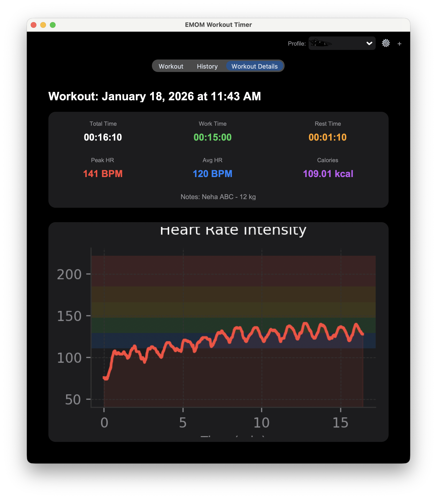

# EMOM Workout Timer

A modern, python-based EMOM (Every Minute on the Minute) timer application built with CustomTkinter. This app helps you track your high-intensity interval workouts with precision, offering visual cues, sound effects, history tracking, and progress visualization.

## Screenshots

<p align="center">
  
  &nbsp; &nbsp;
  
   &nbsp; &nbsp;
  
</p>

## Features

### ⏱️ Advanced Timer
- **Flexible Configuration**: Set your **Total Rounds**, **Work Duration**, and **Rest Duration**.
- **Workout Templates**: Save your custom workout setups (rounds, work/rest times, and notes) as named templates to quickly load or delete them from the main view.
- **Continuous Mode**: Run your workout continuously with adjusted round completion tracking, controlled by a dedicated stop button.
- **Work & Rest Phases**: The timer clearly distinguishes between "Work" and "Rest" phases with visual status updates.
- **Smart Countdown**: 
    - **Work Phase**: Counts down your configured work time.
    - **Rest Phase**: Automatically switches to a rest timer before the next round begins.
- **Pause & Modify**: Pause the workout and adjust the total rounds dynamically, featuring safety validation to prevent setting total rounds below the current active round.
- **Control**: Start, Pause, Stop, and Reset your workout at any time.

### 🔈 Sound Effects
- **Immersive Audio Cues**: Built-in sound effects to guide your workout without needing to look at the screen.
    - **Work Start**: Plays a sharp "Glass" ding to signal highest intensity.
    - **Rest Start**: Plays a relaxing "Hero" chime to signal recovery time.
- **Self-Contained**: Audio assets are bundled with the app (`sounds/` directory), ensuring portability across macOS systems.

### 👤 User Profiles
- **Multi-User Support**: Create separate profiles for different users (e.g., "Rohit", "Alice").
- **Personal Stats**: Store essential metrics for metabolic calculations:
    - **Sex**: Used to select the appropriate metabolic formula.
    - **Birth Date**: Used to calculate Age for calorie burn estimation.
    - **Weight**: Supports both KG and LBS (auto-converted) for intensity calculations.
- **Max Heart Rate**: Set your Max HR in profile settings to unlock zone tracking.
- **Auto-Connect Settings**: Option to automatically initiate a connection to your heart rate monitor when your profile loads.
- **Isolated History**: History is saved to individual CSV files in your custom storage folder.
- **Global Selector**: Always-visible profile switcher for quick access.

### 📈 Incremental Rest
- **Dynamic Recovery**: Automatically increase your rest time as the workout gets harder.
- **Customizable**: Configure the increment amount (e.g., +5s), interval (e.g., every 2 rounds), and starting round.

### 📊 History & Analytics
- **Automatic Logging**: Every completed workout is automatically saved.
    - Tracks: Start/End time, Rounds completed, Work/Rest settings, Total duration, and Notes.
- **History Dashboard**: Built-in "History" tab.
    - **Polished Table View**: Browse past workouts with formatted dates, clean headers, and single-click rows to load details.
    - **Interactive Activity Graph**: A modern stacked bar chart visualizes your activity over the last 7 days. Click individual bars to jump directly to that day's workout details.

### 🖥️ Workout Details & Day Summaries
- **Daily Workout Aggregation**: Displays all workouts completed on the same day in a unified, grid-aligned details table showing start times, rounds, durations, and heart rate metrics.
- **Clean Formatting**: Columns display clean headers (e.g., `Peak HR (BPM)`, `Calories (kcal)`) and raw values, eliminating repetitive units on every row.
- **Cumulative Timeline Graph**: Heart rate curves for all workouts of the day are chained horizontally on a single cumulative timeline.
- **Visual Consistency**: Both row labels and graph curves are color-coded using the Nord color palette to match the daily activity stacked bar chart.
- **Sleek Graphics**: Lines are kept thin (`linewidth=1.0`) to show high-resolution heart rate details clearly.

### 📝 Workout Notes
- Add custom **Notes** to any workout before starting or saving.
- Notes are saved alongside performance data for future reference.

### 🔋 Smart Power Management
- **Sleep Prevention**: Keeps your laptop awake (both system and display) during an active workout, so you never lose sight of the timer.
- **Auto-Release**: Automatically restores normal power settings when the workout finishes or pauses.

### ❤️ Heart Rate Intelligence
- **Bluetooth Integration**: Connect compatible BLE heart rate monitors (e.g., Polar H10).
- **Zone Training**: Real-time display of your Training Zone (1-5) based on your Max HR.
    - Color-coded feedback (Blue → Red) for instant intensity awareness.
- **Auto-Reconnection Resilience**: If the monitor disconnects unexpectedly during a workout, the app automatically runs up to 2 reconnection attempts with clear visual feedback (e.g., `Scanning... (Retry 1/2)`). You can click **Disconnect** at any time to cancel.
- **Smart Display**: Large, easy-to-read BPM and Zone indicators integrated into the main monitor.
- **Status Indicators**: Visual feedback for connection states (Scanning, Connecting, Connected).
- **Auto-Regulation**: 
    - **Smart Rest**: Extends your rest period automatically if your heart rate is too high to start the next round safely.
    - **Configurable Threshold**: Set a custom "Max Pre-Work HR" in your profile.
    - **Toggles**: Auto-regulation toggles automatically based on your connection state and profile threshold, and can also be dynamically adjusted mid-workout.
- **🔥 Calorie Tracking**: 
    - **Real-Time Calculation**: Estimates calories burned based on your Age, Weight, Sex, and Heart Rate Intensity.

### ⚙️ Settings & Configuration
- **Tabbed Settings Dialog**: Redesigned settings interface with general, profile, and advanced configuration tabs.
- **Custom Data Storage**: Choose a custom storage directory (e.g., on Google Drive or iCloud) for your profiles, templates, workout history, and detailed JSON data.

### ⌨️ Keyboard Shortcuts
- **Space Bar**: Start / Pause / Resume the workout instantly.

## Getting Started

### Prerequisites
- Python 3.x
- Tkinter (Homebrew Python users on macOS must run `brew install python-tk@3.14` or equivalent)
- Required libraries:
  ```bash
  pip install customtkinter pillow matplotlib numpy bleak
  ```

### Running the App
Run the `main.py` file:
```bash
python main.py
```

### Running Tests
To run the complete suite of unit tests, use the standard Python `unittest` module:
```bash
python -m unittest discover -p "test_*.py"
```

## Technical Structure
The application is modularized for better maintainability:
- `main.py`: Core application UI, event coordination, and state management.
- `workout.py`: Pure business logic handling states, transitions, and timing.
- `history_ui.py` & `details_ui.py`: Manages the History Tab and Detailed Visualization.
- `heart_rate.py`: Handles Bluetooth LE communication and heart rate data parsing.
- `storage.py`: Handles CSV/JSON file operations, data persistence, and custom directories.
- `power_management.py`: Cross-platform power saving API wrapper (Windows/macOS).
- `sounds/`: Directory containing bundled audio assets (`Glass.wav`, `Hero.wav`).

## Data Storage
Workout data is stored in your configured directory (defaults to `~/Documents/EMOM Timer/`):
- **Profiles**: `profiles.json` stores user metadata (Max HR, Weight, Age, settings, templates, etc).
- **History CSV**: `[profile_name]_workout_history.csv` (General Summary).
- **Details JSON**: `[profile]_[date]_WO[n].json` (Second-by-second data, HR logs, Calories).
