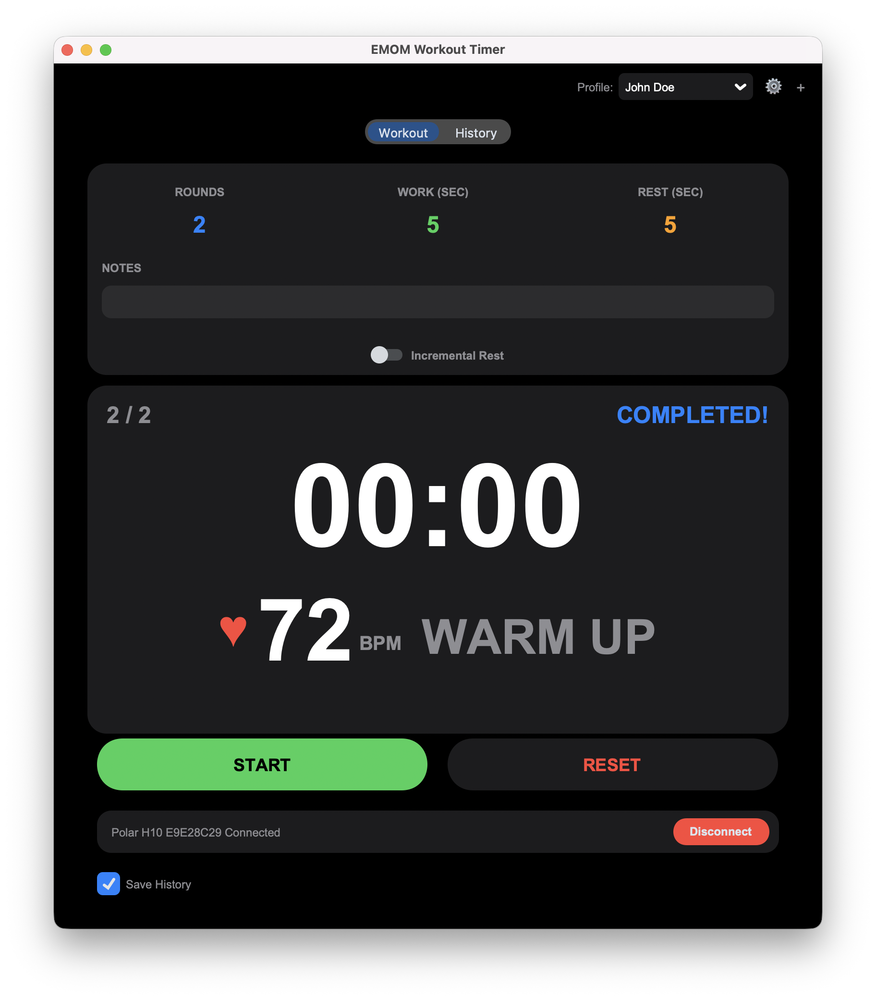
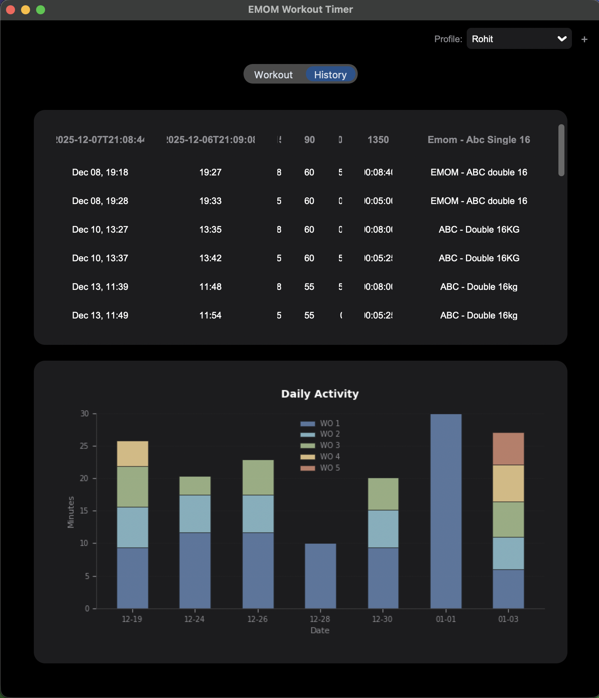

# EMOM Workout Timer

A modern, python-based EMOM (Every Minute on the Minute) timer application built with CustomTkinter. This app helps you track your high-intensity interval workouts with precision, offering visual cues, sound effects, history tracking, and progress visualization.

## Screenshots

<p align="center">
  
  &nbsp; &nbsp;
  
</p>

## Features

### ⏱️ Advanced Timer
- **Flexible Configuration**: Set your **Total Rounds**, **Work Duration**, and **Rest Duration**.
- **Work & Rest Phases**: The timer clearly distinguishes between "Work" and "Rest" phases with visual status updates.
- **Smart Countdown**: 
    - **Work Phase**: Counts down your configured work time.
    - **Rest Phase**: Automatically switches to a rest timer before the next round begins.
- **Control**: Start, Pause, and Reset your workout at any time.

### 🔈 Sound Effects
- **Immersive Audio Cues**: Built-in sound effects to guide your workout without needing to look at the screen.
    - **Work Start**: Plays a sharp "Glass" ding to signal highest intensity.
    - **Rest Start**: Plays a relaxing "Hero" chime to signal recovery time.
- **Self-Contained**: Audio assets are bundled with the app (`sounds/` directory), ensuring portability across macOS systems.

### � User Profiles
- **Multi-User Support**: Create separate profiles for different users (e.g., "Rohit", "Alice").
- **Max Heart Rate**: Set your Max HR in profile settings to unlock zone tracking.
- **Isolated History**: History is saved to individual CSV files in your Documents folder.
- **Global Selector**: Always-visible profile switcher for quick access.

### 📈 Incremental Rest
- **Dynamic Recovery**: Automatically increase your rest time as the workout gets harder.
- **Customizable**: Configure the increment amount (e.g., +5s), interval (e.g., every 2 rounds), and starting round.

### �📊 History & Analytics
- **Automatic Logging**: Every completed workout is automatically saved.
    - Tracks: Start/End time, Rounds completed, Work/Rest settings, Total duration, and Notes.
- **History Dashboard**: Built-in "History" tab.
    - **Polished Table View**: Browse past workouts with formatted dates and clean headers.
    - **Weekly Activity Graph**: A modern stacked bar chart visualizes your activity over the last 7 days.

### 📝 Workout Notes
- Add custom **Notes** to any workout before starting or saving.
- Notes are saved alongside performance data for future reference.

### 🔋 Smart Power Management
- **Sleep Prevention**: Keeps your laptop awake (both system and display) during an active workout, so you never lose sight of the timer.
- **Auto-Release**: Automatically restores normal power settings when the workout finishes or pauses.

### ❤️ Heart Rate Intelligence
- **Bluetooth Integration**: Connect compatible BLE heart rate monitors (e.g., Polar H10).
- **Zone Training**: Real-time display of your Training Zone (1-5) based on your Max HR.
    - Color-coded feedback (Blue → Red) for instant intensity awareness.
- **Smart Display**: Large, easy-to-read BPM and Zone indicators integrated into the main monitor.
- **Status Indicators**: Visual feedback for connection states (Scanning, Connecting, Connected).
- **Auto-Regulation**: 
    - **Smart Rest**: Extends your rest period automatically if your heart rate is too high to start the next round safely.
    - **Configurable Threshold**: Set a custom "Max Pre-Work HR" in your profile.
    - **Toggle**: Enable/Disable this feature with a simple checkbox (only active when HR monitor is connected).
- **🔥 Calorie Tracking**: 
    - **Real-Time Calculation**: Estimates calories burned based on your Age, Weight, Sex, and Heart Rate Intensity.
    - **Personalized**: Configurable profile settings ensure accurate metabolic calculations.
    - **Detailed Insight**: View total calories burned in the workout details summary.

### 🖥️ Modern Experience
- **Monitor Card Layout**: A concise, dashboard-style view grouping Timer, Rounds, and Heart Rate.
- **Resizable Window**: Adjust the app window to fit your screen setup.
- **Global Header**: Easy access to profiles and settings from anywhere in the app.
- **Detailed History**: Double-click any workout in history to view a detailed breakdown, including graphs of heart rate intensity over time.

## Getting Started

### Prerequisites
- Python 3.x
- Required libraries:
  ```bash
  pip install customtkinter pillow matplotlib numpy bleak
  ```

### Running the App
Run the `main.py` file:
```bash
python main.py
```

## Technical Structure
The application is modularized for better maintainability:
- `main.py`: Core application UI and events.
- `workout.py`: Pure business logic handling states, transitions, and timing.
- `history_ui.py` & `details_ui.py`: Manages the History Tab and Detailed Visualization.
- `heart_rate.py`: Handles Bluetooth LE communication and heart rate data parsing.
- `storage.py`: Handles CSV/JSON file operations and data persistence.
- `power_management.py`: Cross-platform power saving API wrapper (Windows/macOS).
- `sounds/`: Directory containing bundled audio assets (`Glass.wav`, `Hero.wav`).

## Data Storage
Workout data is stored in your user Documents folder: `~/Documents/EMOM Timer/`.
- **Profiles**: `profiles.json` stores user metadata (Max HR, Weight, Age, etc).
- **History CSV**: `[profile_name]_workout_history.csv` (General Summary).
- **Details JSON**: `[profile]_[date]_WO[n].json` (Second-by-second data, HR logs, Calories).
